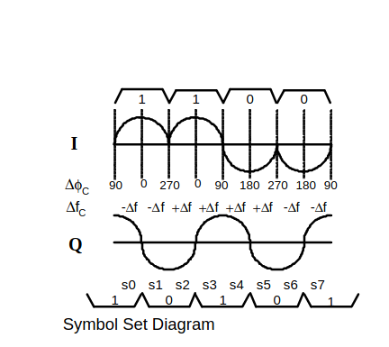
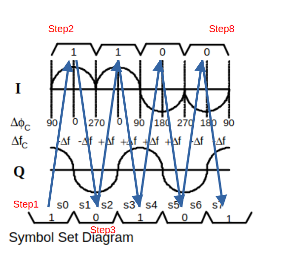
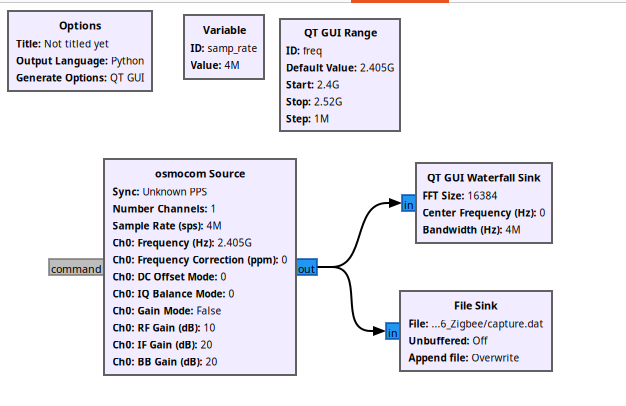
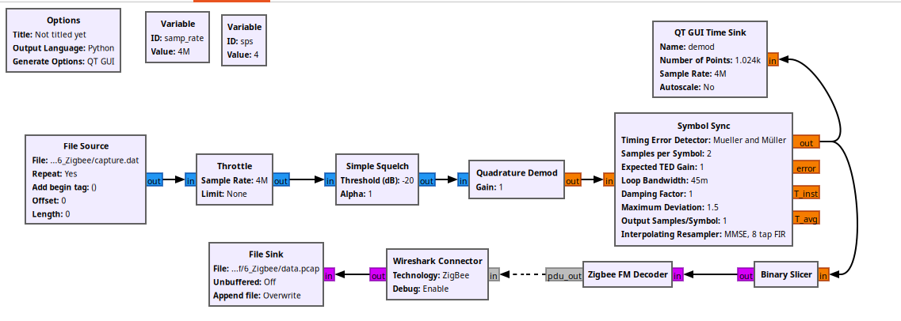
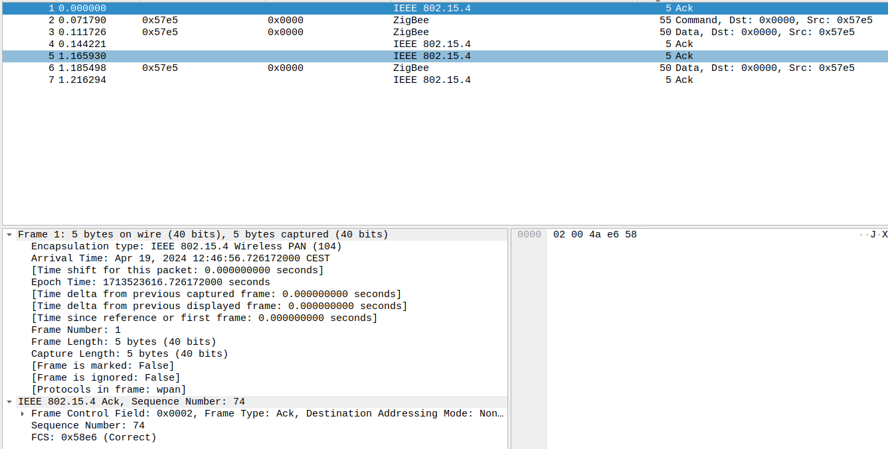

# Zigbee sniffer

NOTE: this is PoC receiver. I'm not DSP specialist. I'm radio amateur and DSP learner.  
NOTE: please unpack samples by executing `bunzip2 capture.dat.bz2`

Some time ago i decided to check how Zigbee is transmitted. I was intrested in radio signal processing (modulation/demodulation) part of Zigbee. I have prepared simple demodulator and packet processor.

I was looking for a demodulator which is easy to learn and implement.
All solutions found by me were not pretty much simple.
One day i have found [gr-foo github repo](https://github.com/bastibl/gr-foo) and i have decided to give a try.


## 1. Zigbee general info

Zigbee is standard used in smart devices. There are different modulation standards and frequencies used by Zigbee. In most cases devices operate at 2.4 GHz. In my home I`m using standard devices operating at 2.4 GHZ so i was focused on this freq/modulation.

On 2.4 GHz there are several channels, 5MHz spacing. My home assistant installation (zigbee2mqtt) is using default one channel 11 which is 2.405 GHz.

Modulation used on 2.4GHz band is O-QPSK. In general we can threat it as QPSK modulation but with Q branch shifted half symbol.
More about O-QPSK [wiki](https://pl.wikipedia.org/wiki/O-QPSK). Polish language - just take a look  QPSK/OQPSK table. 

Another thing - we are using direct sequence spread spectrum - instead of modulating data, we are using additional translation from 4 bits to 32 bits. It will increase the bandwidth.
symbols:  
d=0  11011001110000110101001000101110  
d=1  11101101100111000011010100100010  
d=2  00101110110110011100001101010010  
d=3  00100010111011011001110000110101  
d=4  01010010001011101101100111000011  
d=5  00110101001000101110110110011100  
d=6  11000011010100100010111011011001  
d=7  10011100001101010010001011101101  
d=8  10001100100101100000011101111011  
d=9  10111000110010010110000001110111  
d=10 01111011100011001001011000000111  
d=11 01110111101110001100100101100000  
d=12 00000111011110111000110010010110  
d=13 01100000011101111011100011001001  
d=14 10010110000001110111101110001100  
d=15 11001001011000000111011110111000  


The modulation flow:  
1. 8 bit data is divided on 4 bit chunks  
2. 4 bit chunks are translated to chips.  
3. Chips are multiplexed to I and Q branch and **Q branch is half symbol delayed**  
4. Data is sent as sine pulses (instead of square pulses)  
I have prepared modulator but i need to do additional testing before I publish.

Data rate:  
Raw data rate is 200Kbps  
After step 2 (chunks->chips) - 1 Mbps  
After step 3 (half symbol delay) - 2Mbps  
**For receiving, we are using 4 msps, in our case we have 2 samples per symbol.**  

Such modulation (Q symbol delayed half I symbol and sine pulses) is equivalent to MSK modulation. This is very important for receiving. Instead of building complex receiver we can use simple FM demodulator with some additional data translation. It will be described in FM Demodulator section


For sniffing I`m using HackRF and Gnuradio.
This project was divided on 2 parts.  
 - Part 1 is capturing - straightforward IQ capture  
 - Part 2 decoding - this contains simple FM way of decoding   


## 2. FM Demodulator

I am using non coherent receive of OQPSK using FM demodulator.  
This approach is described in document:  
`CMOS RFIC ARCHITECTURES FOR IEEE 802.15.4 NETWORKS John Notor, Anthony Caviglia, Gary Levy`


The outcome of this document is (according to transition diagram):

* From signal perspective the MSK and O-QPSK is the same transmission but interpreting of
received/sent data looks differently.

* For odd samples k = I xor Q = Q xor I  
For even samples  k = not (I xor Q) = not (Q xor I)  
if k = 0 then delta F =  - delta F  
if k = 1 then dellta F = + delta F  



### 2.1 Decoding example taken from document




1. step even k = 1 xor 1 = 0  result - delta f
2. step odd k = not (1 xor 0) = not 1  result - delta f
3. step even k = 0 xor 1 = 1 result = + delta f
4. step odd  k = not (1 xor 1) = 1 result + delta f
5. step even k = 1 xor 0 = 1 result + delta f
6. step odd  k = not (0 xor 0) = 1 result +delta f
7. step even k = 0 xor 0 = 0 result - delta f
8. step odd  k = not (0 xor 1) = 0 result - delta f

Same calculations in table (for clear readability and better understanding):

|         | S0 | S1 | S2 | S3 | S4 | S5 | S6 | S7 |
|---------|----|----|----|----|----|----|----|----|
| I or Q  | 1  | 1  | 0  | 1  | 1  | 0  | 0  | 0  |
| I or Q  | 1  | 0  | 1  | 1  | 0  | 0  | 0  | 1  |
| XOR     | 0  | 1  | 1  | 0  | 1  | 0  | 0  | 1  |
| NOT odd |    | 0  |    | 1  |    | 1  |    | 0  |
| Result  | 0  | 1  | 1  | 1  | 1  | 1  | 0  | 0  |

0 means - delta  
1 means + delta  

so result is: -delta f, +delta f, +delta f, +delta f, +delta f,  +delta f, -delta f, -delta f

### 2.2 Translation of chips
**Since data representation for FM demodulation is different, we need to translate our chips**
I have added `symbol_translate.py` script for translation. This is same calculation which is
described in this chapter.

```
d0  [1, 1, 0, 1, 1, 0, 0, 1, 1, 1, 0, 0, 0, 0, 1, 1, 0, 1, 0, 1, 0, 0, 1, 0, 0, 0, 1, 0, 1, 1, 1]
d1  [1, 0, 1, 1, 0, 0, 1, 1, 1, 0, 0, 0, 0, 1, 1, 0, 1, 0, 1, 0, 0, 1, 0, 0, 0, 1, 0, 1, 1, 1, 0]
xor [0, 1, 1, 0, 1, 0, 1, 0, 0, 1, 0, 0, 0, 1, 0, 1, 1, 1, 1, 1, 0, 1, 1, 0, 0, 1, 1, 1, 0, 0, 1]
neg [1, 1, 0, 0, 0, 0, 0, 0, 1, 1, 1, 0, 1, 1, 1, 1, 0, 1, 0, 1, 1, 1, 0, 0, 1, 1, 0, 1, 1, 0, 0]
translation result:1100000011101111010111001101100 1618456172
Starting translation of chip: 11101101100111000011010100100010
...
translation result:1001110000001110111101011100110 1309113062
translation result:1101100111000000111011110101110 1826650030
translation result:1100110110011100000011101111010 1724778362
translation result:0101110011011001110000001110111 778887287
translation result:1111010111001101100111000000111 2061946375
translation result:1110111101011100110110011100000 2007919840
translation result:0000111011110101110011011001110 125494990
translation result:0011111100010000101000110010011 529027475
translation result:0110001111110001000010100011001 838370585
translation result:0010011000111111000100001010001 320833617
translation result:0011001001100011111100010000101 422705285
translation result:1010001100100110001111110001000 1368596360
translation result:0000101000110010011000111111000 85537272
translation result:0001000010100011001001100011111 139563807
translation result:1111000100001010001100100110001 2021988657
```

## 3. Capture in gnuradio
Just capture IQ data to file.  
I believe my algorithm for getting packets is not efficient to do it on real HW.



## 4. Decoder in gnuradio
There is not much there - simple FM demodulator (quadrature demod), slicer and packet extractor (Custom block, written by me Zigbee FM decoder).  
Note: For packet analysis Wireshark is used. Added Wireshark connector to produce PCAP packets available at [gr-foo github repo](https://github.com/bastibl/gr-foo)




### 5.1 Decoder in action.

Output for default sample file.
```
Generating: '/home/cod3r/Data/Hackrf/6_Zigbee/process.py'

Executing: /usr/bin/python3 -u /home/cod3r/Data/Hackrf/6_Zigbee/process.py

QSocketNotifier: Can only be used with threads started with QThread
WIRESHARK: d_msg_offset: 0   to_copy: 24   d_msg_len 24
WIRESHARK: output size: 32768   produced items: 24
Synced to preamble and found preamble chip
['0x2', '0x0', '0x4a', '0xe6', '0x58']
WIRESHARK: received new message
message length 5
WIRESHARK: d_msg_offset: 0   to_copy: 21   d_msg_len 21
WIRESHARK: output size: 32768   produced items: 21
Synced to preamble and found preamble chip
['0x61', '0x88', '0xbd', '0x4d', '0x5c', '0x0', '0x0', '0xe5', '0x57', '0x9', '0x1a', '0x0', '0x0',
 '0xe5', '0x57', '0x1e', '0x9a', '0x7b', '0xf4', '0xd8', '0xfe', '0xff', '0x8d', '0x79', '0xe0',
'0x9d', '0x5', '0x73', '0xfe', '0xff', '0x5e', '0x39', '0x90', '0x28', '0x97', '0x15', '0x17', '0x0',
'0x9d', '0x5', '0x73', '0xfe', '0xff', '0x5e', '0x39', '0x90', '0x0', '0xed', '0x7', '0x9b', '0x82',
'0xae', '0x19', '0x70', '0xa4']
```
Wireshark output:


